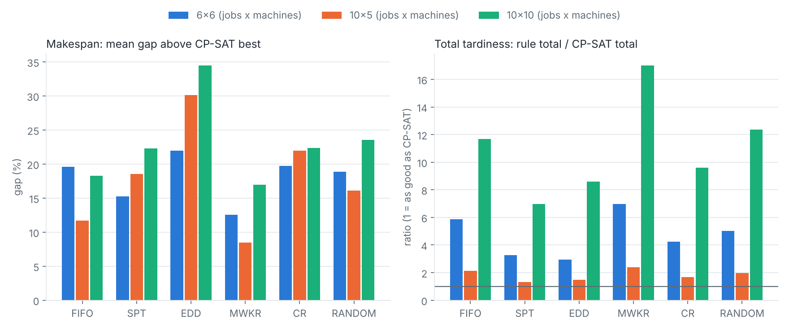

# Dispatching rules vs. an exact solver on the job-shop problem

How much schedule quality do you give up by using a simple shop-floor dispatching rule instead of solving the scheduling problem properly? This project measures that on random job-shop instances, using Google OR-Tools CP-SAT as the reference.

Everything is small and readable: about 300 lines of library code, 13 tests, one script that reproduces every number and figure below.

## The problem

A job shop has `m` machines and `n` jobs. Each job is a fixed sequence of operations, each needing a specific machine for a given time. A machine does one operation at a time, and the operations of a job run in order. Two objectives are studied:

- **Makespan**: the time the last job finishes.
- **Total tardiness**: the sum over jobs of the time finished after the due date.

## What is in the code

| File | Purpose |
|---|---|
| `jobshop/instance.py` | `Instance`, a seeded random generator (durations 1-20, due date = 1.5 x the job's total work), and the classic `ft06` benchmark |
| `jobshop/dispatch.py` | Discrete-event simulation with rules FIFO, SPT, EDD, MWKR (most work remaining), CR (critical ratio) and a seeded RANDOM baseline. Non-delay: a free machine never idles while a job is waiting |
| `jobshop/cpsat.py` | CP-SAT model: interval variables, no-overlap per machine, precedence per job, makespan or tardiness objective |
| `jobshop/schedule.py` | Schedule validator (precedence and machine overlap) and objective values |
| `tests/` | 13 tests, including a hand-worked 2x2 example and the known `ft06` optimum of 55 |
| `run_experiments.py` | Reproduces everything in `results/` |

## Method

Three shop sizes (jobs x machines): 6x6, 10x5 and 10x10, with 15 random instances each (45 in total). Every rule schedule is checked by the validator. CP-SAT gets 5 seconds and one worker per objective per instance. "Gap" is measured against the best CP-SAT solution found.

Run it yourself:

```bash
pip install -r requirements.txt
pytest                      # 13 tests
python run_experiments.py   # a few minutes; writes results/
```

## Results



Mean makespan gap above the CP-SAT best (%):

| Rule | 6x6 | 10x5 | 10x10 |
|---|---|---|---|
| FIFO | 19.6 | 11.7 | 18.3 |
| SPT | 15.2 | 18.6 | 22.3 |
| EDD | 22.0 | 30.2 | 34.5 |
| MWKR | **12.6** | **8.5** | **17.0** |
| CR | 19.8 | 22.0 | 22.3 |
| RANDOM | 18.9 | 16.1 | 23.6 |

Total tardiness, rule total divided by CP-SAT total (1.0 would match CP-SAT):

| Rule | 6x6 | 10x5 | 10x10 |
|---|---|---|---|
| FIFO | 5.9 | 2.1 | 11.7 |
| SPT | 3.3 | **1.3** | **7.0** |
| EDD | **2.9** | 1.5 | 8.6 |
| MWKR | 7.0 | 2.4 | 17.0 |
| CR | 4.3 | 1.7 | 9.6 |
| RANDOM | 5.0 | 2.0 | 12.4 |

CP-SAT proved optimality for makespan on all 45 instances. For tardiness it proved optimality on 15 of 15 (6x6), 0 of 15 (10x5) and 14 of 15 (10x10); see `results/proof_rates.csv`.

On the `ft06` benchmark CP-SAT finds the known optimum of 55 and proves it. The best rule (MWKR) gives 61, FIFO 65, and the worst (SPT) 88. See `results/ft06_gantt.png`.

### What the numbers say

1. **No rule is close to optimal.** Even the best rule for makespan (MWKR) is 8-17% above the optimum on average, and some rules do worse than picking a waiting job at random.
2. **The best rule depends on the objective.** MWKR is best for makespan but the worst-performing informed rule for tardiness; SPT and EDD, which look at job-specific times, do better for tardiness. A rule tuned for one goal can be poor for another.
3. **Rules that look at due dates do not help makespan.** EDD is the worst for makespan in every size.
4. **Tardiness gaps are large and noisy.** Total tardiness near zero makes the ratio swing; 10x10 ratios above 10 come from CP-SAT finding schedules with very little tardiness.

## Limitations

- **Tardiness for 10x5 is not proven optimal on any instance.** The CP-SAT value there is only an upper bound on the true optimum, so the rule/CP-SAT ratios in that column are, if anything, too low (the real ratios are at least as large).
- Results depend on the 5-second limit, the machine and the generator (uniform durations 1-20, due factor 1.5). Different settings, especially tighter due dates, will move the tardiness numbers a lot.
- Gaps are averaged over only 15 instances per size, with no confidence intervals. Differences of a couple of percent between rules should not be over-read.
- Only non-delay dispatching with one tie-break convention is tested. Combined rules, look-ahead rules and metaheuristics (tabu search, genetic algorithms) are not covered.
- Random (not benchmark) instances, except `ft06`.

## Possible extensions

Add composite rules such as ATC, compare against a tabu-search or genetic-algorithm baseline, test other due-date tightness levels, and run the standard Taillard / Lawrence benchmark sets.

## Acknowledgement

Developed with assistance from Claude (Anthropic). The model and experiments were run and checked by the author's test suite; the author is responsible for the content.

## License

MIT
